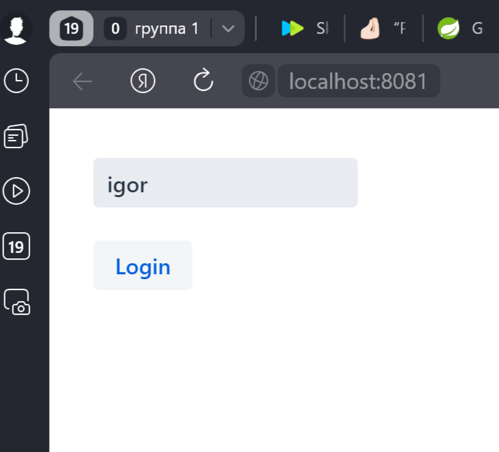
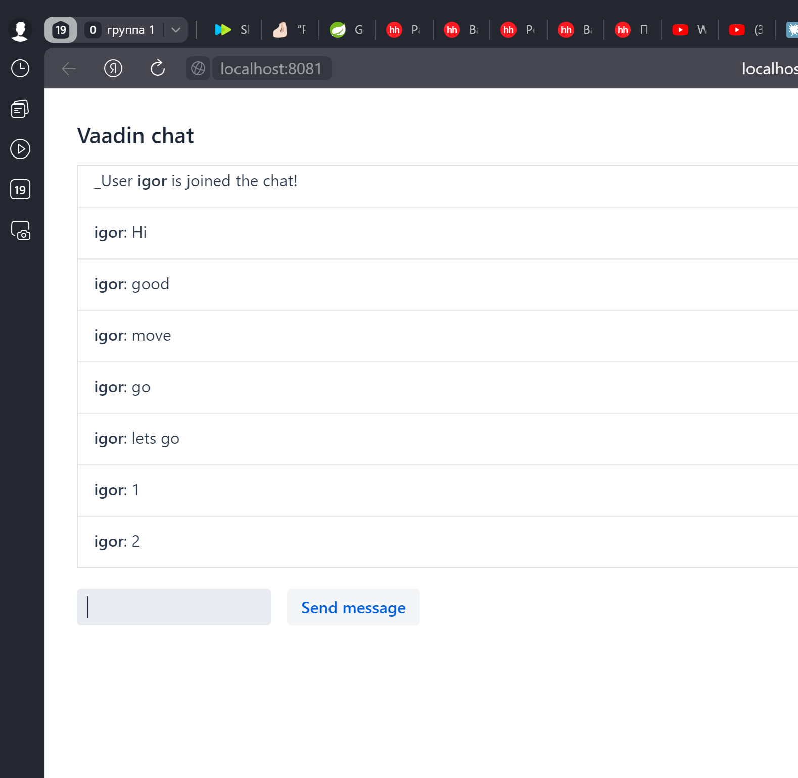

<h1>Локальный чат общения</h1>

## Описание
Версия программы: 0.0.1

Регистрация пользователя: 

Окно общения:

## Реализованный функционал

- Регистрация участника.
- Окно с активной кнопкой и клавишами сопровождения.
- автоматическое обновление чата
- текст чата с прокруткой
- Оповещение о регистрации участника

## Запуск

- Скачиваем весь проект
- Запускаем Docker
- В корне проекта есть файл docker-compose.yaml .
- Запускаем его командой docker compose up
- После запуска чат будет доступен по порту 8081 http://localhost:8081.

## Используемые технологии

- Java 11
- Spring Boot 3.1.1
- Vaadin 24.1.2
- Liombok
- commonmark 0.17.2

## Автор проекта

- <a  href="https://github.com/igr76">Грицук Игорь</a>

